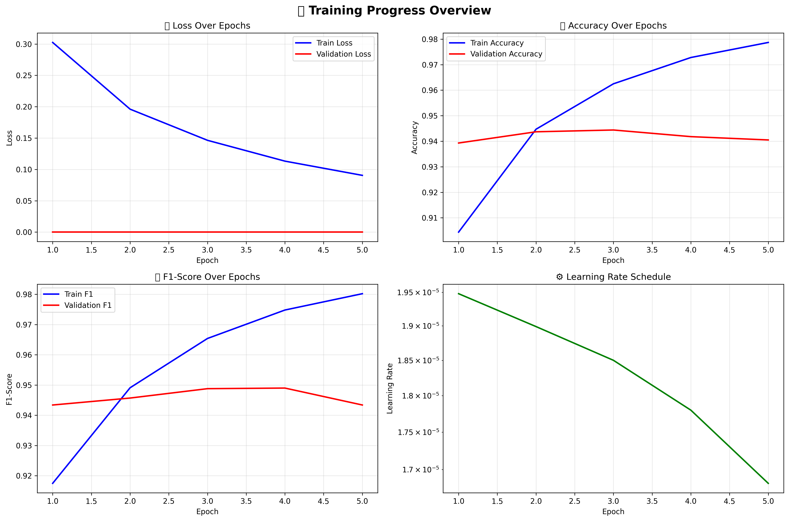

# 🇻🇳 Vietnamese Sentiment Analysis with PhoBERT

[](https://python.org)
[](https://pytorch.org)
[](https://huggingface.co/transformers)
[](LICENSE)

A high-performance Vietnamese sentiment analysis system using PhoBERT, achieving **94%+ accuracy** on the UiT-VSFC dataset.

## ✨ Features

- 🎯 **High Accuracy**: 94%+ test accuracy on Vietnamese sentiment classification
- 🚀 **PhoBERT-based**: Leverages state-of-the-art Vietnamese language model
- 📊 **Comprehensive Evaluation**: Detailed metrics, visualizations, and analysis
- 🔧 **Production Ready**: Clean code structure and professional implementation
- 📚 **Well Documented**: Jupyter notebooks for exploration and evaluation

## 🚀 Quick Start

### Installation

```bash
# Clone the repository
git clone https://github.com/yourusername/uit_SentimentAnalysis.git
cd uit_SentimentAnalysis

# Install dependencies
pip install -r requirements.txt
```

### Usage

```python
from src.model import PhoBERTSentimentClassifier

# Load trained model
model = PhoBERTSentimentClassifier()
model.load_model('saved_results/final_model')

# Predict sentiment
text = "Thầy giảng rất hay và nhiệt tình"
prediction = model.predict(text)
print(f"Sentiment: {['Negative', 'Neutral', 'Positive'][prediction]}")
```

### Training from Scratch

```bash
# Preprocess data
python src/data_preprocessing.py

# Train model
python src/train.py

# Visualize results
python src/visualize_results.py
```

## 📊 Performance

| Metric | Score |
|--------|-------|
| **Accuracy** | 94.37% |
| **F1 Score** | 94.34% |
| **Precision** | 94.40% |
| **Recall** | 94.37% |

### Dataset Statistics
- **Total Samples**: 16,175
- **Classes**: Negative (46%), Positive (50%), Neutral (4%)
- **Train/Dev/Test**: 70.6% / 9.8% / 19.6%

## 🏗️ Architecture

```
PhoBERT Base (135M parameters)
    ↓
RobertaForSequenceClassification
    ↓
3-class sentiment output
```

**Key Components:**
- **Model**: PhoBERT + RoBERTa classification head
- **Tokenizer**: PhoBERT tokenizer with 256 max length
- **Optimizer**: AdamW with linear warmup
- **Training**: 20 epochs, batch size 16, learning rate 2e-5

## 📁 Project Structure

```
uit_SentimentAnalysis/
├── src/                     # Source code
│   ├── data_preprocessing.py   # Data preparation
│   ├── model.py               # Model architecture
│   ├── train.py               # Training script
│   ├── data_loader.py         # Data loading utilities
│   ├── utils.py               # Helper functions
│   └── visualization.py       # Plotting functions
├── data/                    # Dataset
│   ├── raw/                   # Original UiT-VSFC data
│   └── processed/             # Preprocessed data
├── notebooks/               # Jupyter notebooks
│   ├── EDA.ipynb             # Exploratory data analysis
│   └── Evaluation.ipynb      # Model evaluation
├── saved_results/           # Training outputs
│   ├── final_model/          # Best trained model
│   ├── plots/                # Training visualizations
│   └── logs/                 # Training logs
└── models/                  # Model configurations
```

## 📈 Training Results



The model achieves stable convergence with:
- **Best validation accuracy**: 94.37% (Epoch 2)
- **Final training accuracy**: 97.87% (Epoch 5)
- **Training time**: ~2-3 hours on GPU

## 🔬 Evaluation

Comprehensive evaluation includes:
- **Confusion Matrix**: Class-wise performance analysis
- **Classification Report**: Precision, recall, F1 per class
- **Real-world Testing**: Teacher evaluation scenarios
- **Visualization**: Training curves and metrics

See [`notebooks/Evaluation.ipynb`](notebooks/Evaluation.ipynb) for detailed analysis.

## 🛠️ Technical Details

### Model Configuration
```python
{
    "model_type": "roberta",
    "num_labels": 3,
    "max_length": 256,
    "batch_size": 16,
    "learning_rate": 2e-5,
    "epochs": 20,
    "warmup_steps": 0,
    "weight_decay": 0.01
}
```

### Dependencies
- **PyTorch**: Deep learning framework
- **Transformers**: Hugging Face transformers library
- **PhoBERT**: Vietnamese BERT model
- **Scikit-learn**: Evaluation metrics
- **Matplotlib/Seaborn**: Visualization

## 📝 Dataset

This project uses the **UiT-VSFC** (Vietnamese Students' Feedback Corpus) dataset:
- **Source**: University of Information Technology, VNU-HCM
- **Domain**: Student feedback on courses and teachers
- **Languages**: Vietnamese
- **Format**: Text classification (3 classes)

## 🤝 Contributing

1. Fork the repository
2. Create a feature branch (`git checkout -b feature/new-feature`)
3. Commit changes (`git commit -am 'Add new feature'`)
4. Push to branch (`git push origin feature/new-feature`)
5. Create a Pull Request

## 📄 License

This project is licensed under the MIT License - see the [LICENSE](LICENSE) file for details.

## 🙏 Acknowledgments

- **PhoBERT Team**: For the excellent Vietnamese language model
- **UiT-VSFC Dataset**: For providing the sentiment analysis dataset
- **Hugging Face**: For the transformers library
- **PyTorch Team**: For the deep learning framework

## 📧 Contact

If you have any questions or suggestions, feel free to open an issue or contact the maintainers.

---

⭐ **Star this repository if you find it helpful!** 